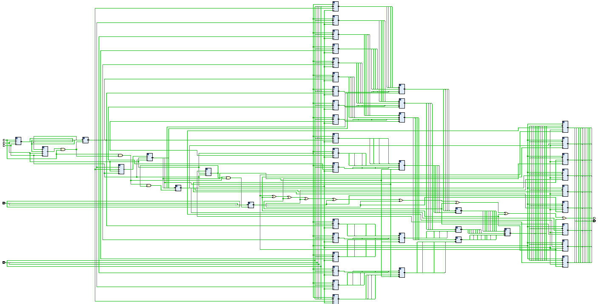

# Matrix Multiplication Accelerator

## Description
This project implements a Matrix Multiplication Accelerator using logic gates. It takes 4-bit binary inputs, requiring a total of 18 inputs to fill two matrices. The design employs parallel data processing, enhancing performance by executing multiple stages of the multiplication algorithm concurrently. The circuit is structured as Serial In, Serial Out (SI SO), with inputs and outputs stored in registers for efficient data handling. Through pipelining and parallel processing, this design optimizes resource utilization and minimizes processing time, offering insights into digital circuit design and matrix operations. The optimized design ensures swift computation by achieving the minimum number of clock cycles required, which is 9 cycles, to calculate and output the results.

## Specifications
- **Designer**: Praneeth KSS
- **Input Terminals**: 11
- **Output Terminals**: 10
- **Clock Cycles Required**: 27 cycles
- **Format**: Serial In, Serial Out (SI SO)

## Usage Guidelines
1. **Clock Pulses**: Apply a clock pulse after each input and apply 9 additional clock pulses after giving all inputs.
2. **Output Address**: To get a specific output, provide the respective output address via address lines.

## Module Description
The `MATRIX_MULTIPLIER` module is designed to perform matrix multiplication for two 3x3 matrices with 4-bit binary values. Below is a brief overview of the components used in the module:

### Inputs and Outputs
- **Inputs**:
  - `clk_i`: Clock input
  - `enable`: Enable signal
  - `reset`: Reset signal
  - `out_sel`: 4-bit address for output selection
  - `data_in`: 4-bit data input

- **Outputs**:
  - `data_out`: 10-bit data output

### Internal Components
- **Counters**: `Five_B_Counter`, `Custom_Counter_1010`
- **Decoders**: `Five_In_Decoder`, `Custom_Decoder_1010`, `Custom_Decoder_0to8`
- **Registers**: `Four_B_Register`, `Ten_B_Register`
- **Multiplexers**: `Three_X_Four_In_Mux`
- **Multipliers**: `Four_B_Multiplier`
- **Adders**: `Three_X_8_Bit_Adder`
- **Custom Logic Blocks**: `Custom_Logic_Block_1`, `Custom_Logic_Block_2`, `Custom_Logic_Block_3`

### Operation
The module follows these steps for matrix multiplication:
1. Load inputs into registers.
2. Use multiplexers to guide data through the circuit.
3. Multiply the selected elements.
4. Add the partial products.
5. Store and output the final product based on the provided address.

## File List
- `MATRIX_MULTIPLIER.v`: Main Verilog module for the matrix multiplier.
- `README.md`: Project description and usage guidelines.

## Schematic

---

Feel free to contribute to this project by opening issues or submitting pull requests. Your contributions are greatly appreciated!
